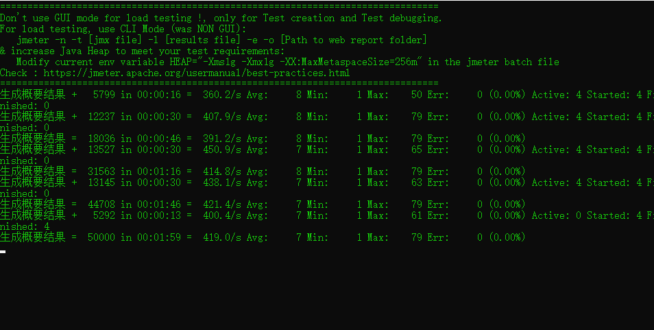
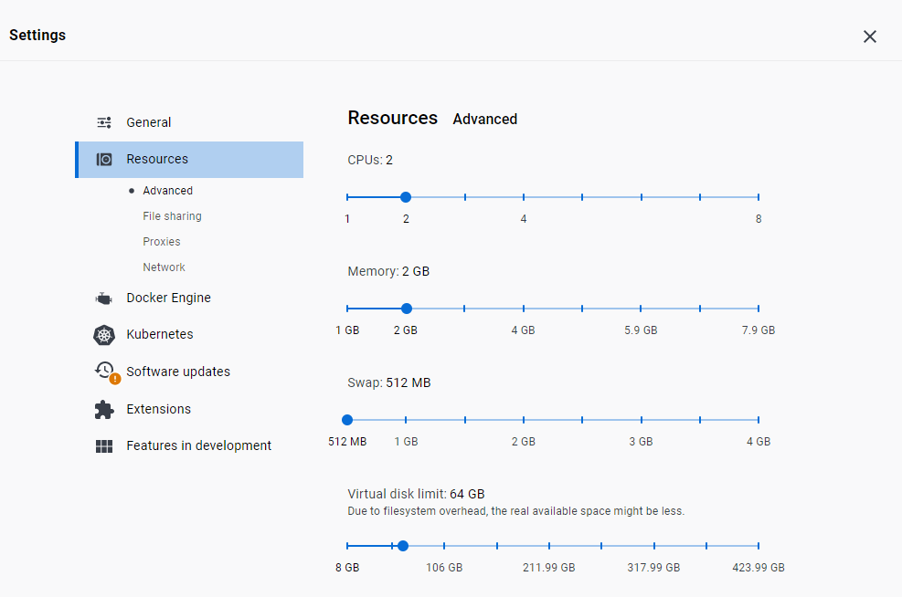
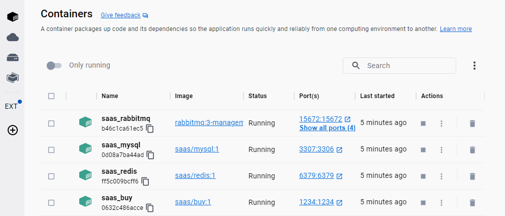
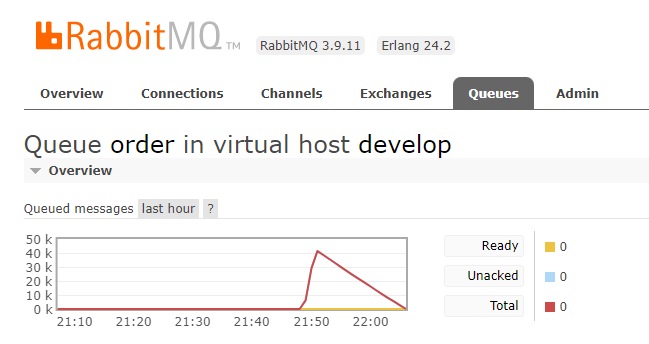
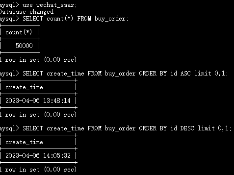

# 系统性能（本地预估，不代表生产表现）
【声明】
本系统系一个微服务系统，是作为一个大型分布式系统的一部分或称异构子系统而研发的，目前的状态是技术探索落地，追求高效而尽可能地低成本，不追求业务的复杂度。

测试环境：win10，不限网络带宽，CPU/内存：2 core / 2 GiB。

用户参与抢购，发送请求







## 订单生成耗时
通过数据库记录的第一条数据和最后一条数据的 create_time 差值计算
```
mysql -h localhost -P 3307 -r root -p
SELECT count(*) FROM buy_order;
SELECT create_time FROM buy_order ORDER BY id ASC limit 0,1;
SELECT create_time FROM buy_order ORDER BY id DESC limit 0,1;
```
>为7分18秒




# 业务-逻辑

这是一个业务系统的重构项目，展示了golang的显著优势：1.互联网的C语言 2.简单开发而高效使用  

参考文章:

【1】https://github.com/gzc426/Java-Interview/blob/master/%E9%A1%B9%E7%9B%AE%E6%8E%A8%E8%8D%90/%E7%A7%92%E6%9D%80.md  
【2】https://mp.weixin.qq.com/s?__biz=MzU0OTE4MzYzMw==&mid=2247517155&idx=4&sn=bf198afe7d2b498063a0416accffe74f&chksm=fbb10a1dccc6830be5c6b74cbf2de93c9fdd9dd12da4ae1c9b407d35949b92e8656856b7cd16&scene=27  

## 页面静态化
1.商品静态化。商品的名称、描述、图片等相对固定，把他们做成静态页面，后期可以通过管理端生成，通过nginx等进行动静分离，把对商品页面的刷新和加载和后端服务分离开，由nginx承担。为了保证数据完备性，后端仍要建立完整的商品表，并且也为未来拓展生成静态页面功能作基础。
2.库存需要发送请求获取，每刷新一次页面获取一次库存，库存请求通过 后端服务 打在redis上，避免访问mysql，以避免磁盘I/O。
3.点击秒杀按钮触发请求后端服务，进入抢购流程。

## 读多写少
只有少数人才能秒杀成功，把订单写入数据库，多数人只能读库存，然后秒杀失败，所以是 读多写少。
使用redis缓存解决方案：
1.缓存商品id、对应库存

生成缓存方式：
1.预热
开始秒杀时，把所有的商品id和库存，同步到缓存中
2.redis商品数据过期--缓存击穿
2.1 解决缓存击穿
预热的缓存数据有可能过期失效，缓存失效后，后端服务在redis查不到时一般回去mysql查，为了防止瞬间全部流量打在mysql上，使用lua脚本，把 查询到建立缓存 这段逻辑使用lua脚本代替。
3.查找不存在的商品id--缓存穿透
使用布隆过滤器，上架商品时，先在布隆过滤器中生成指纹，布隆过滤器的逻辑是 说一个指纹见过，可能实际是见过或没见过；说一个指纹没见过，实际就真的没见过。请求查询商品库存时，先访问布隆过滤器，如果查不到该商品，就表示mysql也没有该商品，直接返回抢购失败，避免缓存穿透。

## 库存扣减
要解决的问题：
1.并发扣减内存时，保证不超卖
2.并发时防止重复卖给同一用户

解决方案：使用原子操作 代替 锁。
1.先判断商品id是否存在，如果不存在则直接返回。（不管理商品缓存，只管理库存）
2.获取该商品id的库存，判断库存如果是-1，则直接返回，表示不限制库存。
3.如果库存大于0，则扣减库存。
4.如果库存等于0，是直接返回，表示库存不足。

## 使用Redis+Lua实现解决方案
https://help.aliyun.com/document_detail/92942.html

KEYS[1]是传入的key值，相当于函数的参数，可多次使用。
```
if (redis.call('exists',KEYS[1])==1) then
    local stock = tonumber(redis.call('get',KEYS[1]))
    if (stock == -1) then -- 不限库存
        return -1
    end
    if (stock>0) then
        redis.call('incrby',KEYS[1],-1) -- 扣减库存
        return stock -- 返回本次消耗库存之前的库存
    end
    return 0 -- 库存不足
end
return -2 -- 不存在该商品
```

## mq（Message Queue）异步处理
秒杀->下单->支付，三者并发量不均等，秒杀最大，下单和支付很小。
支付模块需要对接第三方系统，本项目留好接口，不作实现。

1.通过 消息队列，让秒杀的下单解耦，下单和支付解耦。

基本架构：秒杀->mq服务器->下单->mq服务器->支付，使用异步消息。

常见问题：
如何保证消息被消费呢？
秒杀->mq服务器 之间增加 消息发送表，该表记录了已发送消息的状态：待处理/已处理，下单（消费者）消耗该消息，调用 消息发送表 修改状态为已处理，ack应答。

如何防止消息丢失呢？
为了保证 秒杀 发送的 消息 一定能到达 mq服务器，使用job，增加重试（重发）机制，类似TCP。
job每隔一段时间去查询消息发送表中状态为待处理的数据，然后重新发送mq消息。

如何防止重复消费呢？
当消费者消费完毕后，需要发送 ack消息 ，修改消息状态为 已处理。如果ack消息发送失败，将造成 消息的重复消费，加上 重试机制，消息重复消费概率增大。
在 mq服务器->下单 之间增加 消息处理表，标记哪些消息（id）是已经处理过的，再次遇到该消息时，直接不作处理。关键点，要保证 消息处理表 和 下单 是绝对一致的，放在同一个事务中，保证原子操作。

如何处理垃圾消息问题？
下单一直失败，一直没有调用 消息状态修改，job 会一直重试。这里直接设置 消息发送表 发生次数上限，达到上限，不再发该消息，未达上限，将次数加1，正常重试发消息。

如何处理延迟消费问题？
15分钟之内还未完成支付，订单取消，库存恢复。
下单->支付 之间的消息发 延迟消费消息，达到 延迟时间后，支付 消费该消息，如果 订单状态是 待支付，修改该订单状态为取消，库存恢复，否则，说明已支付。

2.怎么做消息队列和消费保证
本系统基于golang，为了保证部署的简单，这里使用redis.Stream作为消息队列，redis.Stream参考了kafka的设计。

通过PEL+ack保证消息已消费，通过redis本身的持久化能力，保证消息队列本身不会丢失。

## 限流
1.如果用户全部用手抢，也会不断 点击 秒杀按钮，一个用户会生成多条请求。
2.如果用户使用机器生成请求，1s可生成上千请求，而人手一秒只能生成一条请求。

常见方案：
对1，在前端JS中限制，每多少秒，可以发送1次请求，但是对2无效，2可以绕过JS限制。为了公平，需要在后端限流。

方案：限制同一个用户id，比如每分钟只能请求5次接口。
问题：请求方 模拟多个用户请求时无效

方案：限制同一个ip
问题：可能会导致公用ip的所有用户被连累。请求方 使用代理模拟请求ip时无效

推荐方案：移动滑块验证码
问题：影响用户体验，操作繁琐。解决方案是，提高业务门槛，使用用户画像，例如只有正式会员才能参与抽奖、等级到达3级以上的才可以参与、男性用户才可以参与。

本系统方案：
1.在几千-几万流量时，主要通过golang的rete包的 令牌桶方案 来限流，即业务层（网络模型的应用层）做限流
2.在十几万-几十万流量时，在nginx通过限制连接数来限制流量，即主机流量层（网络模型的网络层）做限流


封装MySQL https://www.liwenzhou.com/posts/Go/mysql/ 

# 项目架构说明

## 系统的数据状态
本系统状态采用 启动预热 方式设置系统初始数据状态，即启动系统时，马上把数据库相应的数据预热到 redis中，后期将继续拓展 动态配置 方式，即通风后台管理端，把数据提交到数据库，然后马上缓存一份到redis中，让系统数据状态可控。

## 1.不使用orm
考虑到系统拓展、维护的复杂度，不使用orm

## 2.model 设计
本项目的 model 设计如下：
1.接口model围绕接口最终数据设计，不围绕基础表的结构设计。
2.表的mode围绕基础表的结构设计。

## 3.隔离级别
本系统设计上，抢购功能尽量采用消息队列，避免并发访问mysql，但是其他模块仍可能并发访问mysql，因此使用 事务隔离级别3。

读未提交 READ UNCOMMITTED | 0 : 存在脏读，不可重复读，幻读的问题。   
读已提交 READ COMMITTED | 1 : 解决脏读问题，存在不可重复读，幻读（幻行）的问题。  
可重复读 REPEATABLE READ | 2 : 解决脏读，不可重复读的问题，存在幻读（幻行），默认隔离级别，使用MVCC机制（多版本并发控制）实现可重复读。  
序列化 SERIALIZABLE | 3 : 解决脏读，不可重复读，幻读，可保证事务安全，但完全串行执行，性能最低。  

## 4.时间处理
在连接数据库时，开启parseTime=True，自动把datetime转换golang的time.Time。
https://github.com/go-sql-driver/mysql#columntype-support

## 5.请求参数的校验
关于请求参数的校验，参考以下：  
【1】https://gin-gonic.com/zh-cn/docs/examples/binding-and-validation/  
【2】https://pkg.go.dev/github.com/go-playground/validator/v10#hdr-One_Of  
【3】https://raw.githubusercontent.com/go-playground/validator/master/_examples/simple/main.go  
gin集成了很好使用的参数校验，包括缺失校验、类型校验等。另外，服务端只作简单校验，保证基本数据不缺失和类型正确，以减少服务复杂度，降低系统运维、拓展成本，业务校验如手机号校验，由前端来保证。

注意，如果一个参数可以为空，那么校验就不要使用required，如
```
Remarks  string `json:"remarks" binding:"required"`
```
一旦用户向remarks传入""，将会被校验为 remarks未传值而不是 remarks传了值但是是空值，这会使校验失败。因为，应该将这里参数设置为可不传。
```
Remarks  string `json:"remarks"`
```

## 6.分页查询
分页查询是后台管理最基本的功能，本系统仅作设计，暂不实现。设计如下：  
请求时，传入以下参数：  
```
per 每页记录数
total 总记录数
page 当前是第几页

total = page*per
```

## 7.时间的处理
注意这样一段程序：
```
package main

import (
	"fmt"
	"time"
)

func main() {
	location, err := time.LoadLocation("America/Los_Angeles")
	if err != nil {
		panic(err)
	}

	timeInUTC := time.Date(2018, 8, 30, 12, 0, 0, 0, time.UTC)
	fmt.Println(timeInUTC.In(location))
}

```
Output:
2018-08-30 05:00:00 -0700 PDT

看起开很奇怪的时间格式实际上是通用格式，直接返回给前端即可。
PDT时间(Pacific Daylight Time)太平洋夏季时间，比UTC早7小时，而北京时间比UTC晚8小时，通常认为GMT和UTC一致，即GMT=UTC+0。

这种时间格式和我们国内应用常见的 2022-01-02 13:55:11 不太一样，后者通过前端JS的Date()或者使用moment.js可以很方便地得到
```
new Date("2018-08-30 05:00:00 -0700 PDT")
Thu Aug 30 2018 20:00:00 GMT+0800 (中国标准时间)

new Date("2023-03-27T16:15:47+08:00")
Mon Mar 27 2023 16:15:47 GMT+0800 (中国标准时间)
```

## redis的准备
参考：  
【1】https://hub.docker.com/_/redis  
【2】https://redis.uptrace.dev/zh/guide/go-redis.html  
【3】https://redis.io/commands/xtrim/  
【4】https://redis.io/commands/xadd/  

本系统将使用redis的两项功能，一是持久化缓存，二是异步消息队列。

持久化缓存：
```
docker run --name buy -d redis redis-server --save 300 1 --loglevel warning
```
容器后台运行，每300秒若至少有1次写操作，就进行一次快照保存，只记录warning级别的log

Redis进程运行日志的级别优先级从高到低分别是warning、notice、verbose、debug，程序会打印高于或等于所设置级别的日志，设置的日志等级越高，打印出来的日志就越少。

运行日志：
1.warning warning表示只打印非常重要的信息。  
2.notice notice表示打印适当的详细信息，适用于生产环境。  
3.verbose verbose表示记录系统及各事件正常运行状态信息。  
4.debug debug表示记录系统及系统的调试信息。  

【注意】
在开发和测试阶段，应采用本地目录；生成环境，使用创建的卷。

```
#dev
docker run -p 6379:6379 -v C:/Users/Administrator/Desktop/v:/data --name buy -d redis redis-server --save 300 1 --loglevel warning 

# prod
docker volume create v1
docker run -p 6379:6379 -v v1:/data --name buy -d redis redis-server --save 300 1 --loglevel warning 
```


## 8.redis扣减库存的设计
参考：
【1】https://redis.com/redis-best-practices/lua-helpers/  

```
HGET stock 1001
HEXISTS stock 1001
HSET stock 1001 100
```

使用lua脚本做到原子操作
```
if (redis.call('HEXISTS',KEYS[1],KEYS[2])==1) then
    local stock = tonumber(redis.call('HGET',KEYS[1],KEYS[2]))
    if (stock == -1) then -- 不限库存
        return -1
    end
    if (stock > 0) then
        stock = stock - 1
        redis.call('HSET',KEYS[1],KEYS[2],stock) -- 扣减库存
        return stock -- 返回本次消耗库存之后的库存
    end
    return 0 -- 库存不足
end
return -2 -- 不存在该商品
```

## 9.限流
context的超时时长不能小于一个令牌生成的时长，否则，只有一开始的请求可以拿到Bursts个令牌，后来的请求，失败率很高。
通过rate的两个方法可以实现，根据 活动表的字段 动态地设置限流效果
```
rate.Limiter.SetLimit()
rate.Limiter.SetBurst()
```

## 10.异步生成订单
订单生成和抢购是否成功的响应是异步的，通过基于redis.Stream设计的异步消息队列来实现（见前面redis部分）。另外，由于在用户请求完成时，订单号可能还没生成，后期可以设计一个排队号字段返回，这个字段加在订单表上更合适，其作为抢购成功的凭证向客户返回，生成算法是：

活动id-商品id-用户-当前库存，其中当前库存（stock）是由redis的原子操作保证 并发安全，是全局唯一的，因此可以保证 抢购成功凭证 全局唯一。

【注意】
到目前未知，抗住高并发压力的措施有：1.限流器  2.redis缓存库存  3.异步消息队列。


## 异步消息队列的演变
使用 消息队列中间件 的变态之处在于，web服务在把所有订单生成的请求 做成消息发送给消息队列后，web服务甚至就可以下线了，接下来就是 订单处理模块 和 消息队列的事情了。

### 演变1 -- channel
使用golang本身 带缓冲区的通道，看起来很适合 异步消息队列，支持先进先出，堵塞读写，内存消耗小，不需要额外部署，和go web应用本身一起打包运行。
当然，风险就是，如果服务意外退出，这个充当 异步消息队列 功能的通道也会退出，所有的消息都会丢失，且正常运行下还要自己实现一个 消费确认ack机制，但是不需要实现一个消息重发，除非取出否则消息是肯定在 通道内的。还有，要及时清理已消费的消息，保证不会把内存爆掉。

### 演变2 --redis.Stream
由于redis实际上是一个黑盒，因此需要 验证性 的操作，保证代码可靠。
本系统采用的开发方式是，使用以下命令测试redis.Streams并与本系统行为进行对比，检查正确性。
1.创建stream
MAXLEN ~ 1000 限定长度约是1000，可能多几十条，或MAXLEN = 1000，精确控制数量。
```
XADD key [NOMKSTREAM] [<MAXLEN | MINID> [= | ~] threshold
  [LIMIT count]] <* | id> field value [field value ...]
```
```
XADD ww MAXLEN ~ 10000 * user 1001 product_id 1001
XADD ww MAXLEN ~ 10000 * user 1002 product_id 1002
XADD ww MAXLEN ~ 10000 * user 1003 product_id 1003
XADD ww MAXLEN ~ 10000 * user 1004 product_id 1004
XADD ww MAXLEN ~ 10000 * user 1005 product_id 1005

XRANGE ww - + #查看stream
XLEN ww #查看stream长度
```

2.创建消费组
规定组内消费者从第一条消息开始消费：0-0
```
XGROUP CREATE ww cg1 0-0
```
获取stream各消费组的详情
name表示组名，entries-read表示已被读取数，lag表示未被读取数
```
XINFO GROUPS ww 
```

3.组内消费
```
XREADGROUP GROUP group consumer [COUNT count] [BLOCK milliseconds]
  [NOACK] STREAMS key [key ...] id [id ...]
```
一条一条消费，>指定读取 从未被消费过的消息，0指定当前消费者消费了但未ack的消息
```
XREADGROUP GROUP cg1 c1 COUNT 1 BLOCK 0 STREAMS ww >
XREADGROUP GROUP cg1 c1 COUNT 1 BLOCK 0 STREAMS ww 0
```

4.ack确认消费
```
XACK ww cg1 1680100221976-0
```

【思考-问题】
总的来说，redis是内存数据库，快但是代价昂贵。使用 redis.Stream 作 异步消息队列，意味着消息队列是存在于内存的，有爆内存的风险，除非使用MAXLEN，一个办法是使用 MAXLEN ~ 1000 ，不使用 MAXLEN = 1000，因为后者存在性能问题。
MAXLEN ~ 1000 是插入新的消息，驱逐旧的消息，但是不是精确控制 最长长度就是1000，~表示约等，可能多几十。应用在本系统时，由于无法预估I/O情况，和数据库打交道的 订单生成模块（消费组）无法保证处理速度，如果一些老的消息，因为消费者I/O突然变慢，没来得及消费，就可能被 redis 驱逐而丢失，可是这些消息是未被消费的，于是这个异步消息队列变得不可靠，订单生成数据丢失。

对于redis.Stream，是支持多个消费组来消费，每个组内的消费组虽然有 ack 机制，但是是组内隔离，ack后删除的消息只是消费者的PEL，并不是 redis.Stream ，所以无法通过 ack 机制删除消息。 

一个解决方案是，使用 XLEN 判断异步消息队列长度，若长度超过一定数，则停止插入消息，等待一定时间后，再尝试插入消息，若等待还是超过一定数也会直接插入，若不直接插入，也可以循环等待，在用户请求timeout前返回 抢购失败，这种处理方式要统计 失败率。


### 演变3 --rocketMQ

rocketMQ的基本流程是：生产者--生产--主题--队列--订阅--消费组--消费者--消费

本系统仅是生产订单，不涉及其他多个子系统，所以只需要使用 Normal普通消息，而不需 Transaction事务消息，在消费者方面，SimpleConsumer 就够用了，PushConsumer 高度封装，复杂度高不适用本系统，且SimpleConsumer的重试时间为 消费不可见时间，是固定的，不需要设计复杂的重试时间策略。

日后对接 物流系统、积分系统等，再上 事务消息；对于有顺序要求的业务，使用 基于队列组的 顺序消息 和 已经封装好的 保证消息消费的顺序性 的PushConsumer 完成。
见：https://rocketmq.apache.org/zh/docs/featureBehavior/03fifomessage


使用docker手动部署RocketMQ如下：

参考资料：
【1】https://github.com/apache/rocketmq  

1.创建namesrv
```
docker image pull apache/rocketmq
docker run -p 9876:9876 -d --name saas_mqnamesrv apache/rocketmq ./mqnamesrv
```


2.创建Broker.
只能使用本地目录，无法使用卷，用于存储消息
```
docker volume create saas-mq-vol
docker run -p 10911:10911 -d --name saas_broker -v C:/Users/Administrator/Desktop/v:/home/rocketmq/store apache/rocketmq ./mqbroker -n localhost:9876
```

【问题】
经过试验发现，RocketMQ对Go的支持并不好，还在快速迭代器，注意体现在client上，没有比较详尽的资料，examples也与现在的版本对不上。


### 演变4 ---RabbitMQ

参考：
【1】https://www.cnblogs.com/feily/p/14207897.html  
【2】https://hub.docker.com/_/rabbitmq  

推荐：
消息队列使用端口：5672 管理端口：15672
```
docker image pull rabbitmq:3-management
docker run -d -p 4369:4369 -p 5671:5671 -p 5672:5672 -p 15672:15672 --hostname saas_rabbitmq_host --network saas_buy --network-alias saas_rabbitmq --name saas_rabbitmq -e RABBITMQ_DEFAULT_USER=admin -e RABBITMQ_DEFAULT_PASS=123456 rabbitmq:3-management
```

也可以
```
docker image pull rabbitmq:latest
docker run -d -p 4369:4369 -p 5671:5671 -p 5672:5672 -p 15672:15672 --hostname saas_rabbitmq_host --network saas_buy --network-alias saas_rabbitmq --name saas_rabbitmq rabbitmq:latest 
docker exec saas_mq rabbitmq-plugins enable rabbitmq_management
```

然后，采用最简单的 direct模式 开发就足够了，后期还可以很方便扩展，该 消息队列对Go支持很友好。

另外，order表的字段应该少，详情通过id连接其他表，这样可以减少消息队列的消息大小，节省资源。 

【注意】
一定要先使用 mysql prepared statement 预处理，得到一个 SQL语法检查和编译 已经做好的PreparedStatement对象，直接填入参数可以获得更好的性能和防止SQL注入（因为不再进行编译）。


# 测试
## 1.订单数据查看
```
SELECT * FROM buy_order WHERE DATE_FORMAT(create_time,'%Y-%m-%d %T') >= '2023-03-31 20:24:37' and DATE_FORMAT(create_time,'%Y-%m-%d %T') <= '2023-04-02 00:00:00'
```

编写单元测试 go test //TODO


## 2.JMeter 测试结果如下

生成概要结果 =  50000 in 00:00:41 = 1216.8/s Avg:     2 Min:     1 Max:    95 Err:     0 (0.00%)

TPS=1216.8/s


# 部署

## 1.docker容器化部署
参考资料：
【1】https://www.cnblogs.com/shenh/p/9714547.html  
【2】https://yeasy.gitbook.io/docker_practice/network/port_mapping  

采用docker容器部署，且不采用多阶段构建容器，而采用多容器单独部署，然后通过 bridge网络 实现容器间通信。这样做的好处是 保持各容器的独立性，在集群部署时，快速切换到k8s中。

修改docker使用国内镜像：
```
{
  "registry-mirrors": [
    "https://hub-mirror.c.163.com",
    "https://mirror.baidubce.com"
  ]
}
```

搭建网络
```
docker network create -d bridge saas_buy
docker network ls
```


## 2.redis镜像制作--准备redis容器
参考资料：
【1】https://hub.docker.com/_/redis  
【2】https://www.runoob.com/redis/redis-conf.html  
【3】https://blog.51cto.com/u_12835254/5273384  

编写属于redis的Dockerfile：Dockerfile.redis
构建时需要指定Dockerfile文件名：-f ../Dockerfile.php 

```
FROM redis
COPY redis.conf /usr/local/etc/redis/redis.conf
EXPOSE 6379
CMD ["redis-server", "/usr/local/etc/redis/redis.conf"]
```

redis.conf（CONFIG GET * 查看所有配置项）
bind 127.0.0.1：这个配置项一般是直接注释掉的，这个配置开启后就只有本机可以连接redis
```
port 6379 #Redis 监听端口
bind 127.0.0.1 #绑定的主机地址
timeout 0 #不主动关闭连接
loglevel notice#记录notice级别的日志
databases 16 #16个数据库
save 300 1 #每300秒若至少有1次写操作，就进行一次快照保存
dbfilename dump.rdb #本地数据库（rdb）文件名
dir ./ #本地数据库（rdb）存放目录
# requirepass "12345" #数据库密码
maxclients 128 #设置同一时间最大客户端连接数，默认无限制
```

```
docker login -u 用户名 -p 密码
docker image pull redis
docker build -t saas/redis:1 -f Dockerfile.redis .
docker run -p 6379:6379 --name saas_redis --network saas_buy -d  --network-alias saas_redis saas/redis:1
```

## 3.mysql镜像制作--准备mysql容器
参考资料：
【1】https://blog.csdn.net/boling_cavalry/article/details/71055159  
【2】https://hub.docker.com/_/mysql  
【3】https://www.cnblogs.com/felordcn/p/12970489.html  
【4】https://blog.csdn.net/xtjatswc/article/details/109572149  
【5】https://blog.csdn.net/boling_cavalry/article/details/71055159

-e MYSQL_ROOT_PASSWORD=123456: 设置root用户环境变量=123456
```
本地运行MySQL（本项目使用）
docker run --name saas_mysql -e MYSQL_ROOT_PASSWORD=123456 -d mysql:latest

# 连接到远程MySQL上，-h 机器IP
docker run -it --network some-network --rm mysql mysql -hsome-mysql -uexample-user -p
```

容器测试
```
mysql -uroot -p
SHOW databases;
```

本项目建议部署时，采用更加偷懒的模式，在构建MySQL时就进行建表。
PS：<<EOF表示后续的输入作为子命令或子Shell的输入，直到遇到EOF为止，再返回到主Shell。

把sql文件放入docker-entrypoint-initdb.d，可以自动初始化数据库（建表）
不建议把 CURD 语句一起放进去。

Dockerfile.mysql
```
FROM mysql
COPY buy.sql /docker-entrypoint-initdb.d/
```

```
docker login -u 用户名 -p 密码
docker image pull mysql
docker build -t saas/mysql:1 -f Dockerfile.mysql .
docker run --network saas_buy -p 3307:3306 --network-alias saas_mysql --name saas_mysql -e MYSQL_ROOT_PASSWORD=123456 -d saas/mysql:1
```

## 4.Go Web APP镜像制作--准备服务
参考资料：
【1】https://studygolang.com/articles/9463  
【2】https://docs.docker.com/language/golang/build-images/  （Dockerfile部分过时）
【3】https://github.com/docker-library/golang/blob/master/Dockerfile-linux.template
```
docker build -t saas/buy:1 -f Dockerfile .
docker run --network saas_buy --network-alias saas_go -p 1234:1234 --name saas_buy -d saas/buy:1
```

注意，在go容器运行后，调用 log.fatal 会导致容器被退出并删除。另外，本容器运行前，保证redis中不存在名为 mq 的stream，否则容器将启动失败。
使用-it及时查看运行错误，保证不出错后，换成-d即可

对rabbitmq，建立一个专属的 virtual host，然后建立一个用户，绑定该virtual host，保证 本系统的消息队列可以独立运行和被监控或权限控制。


<br>

# TODO List

- [ ] 基于lua+set做防止用户重复下单
- [ ] 全局统一错误日志处理
- [ ] 缓存击穿 -- 布隆过滤器
- [ ] 数据预热
- [ ] 数据管理功能完善
- [ ] 单元测试
